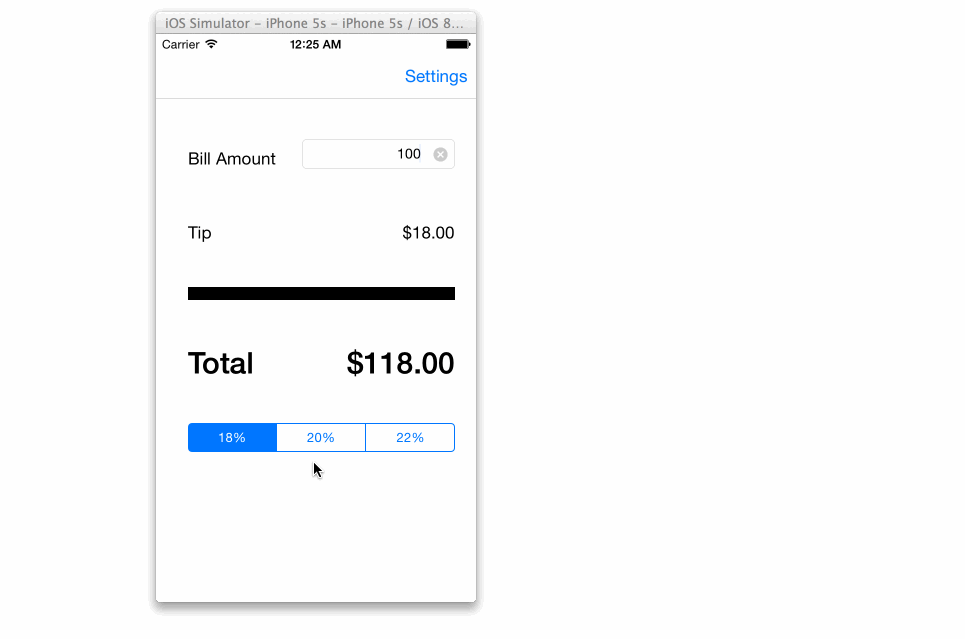

Tip Calculator
=============

Time spent: 4 hours spent in total

Completed user stories:

   * [x] Required: Provide Settings Navigation Bar
   * [x] Required: Allow user to set default tip percentage on settings page
   * [x] Optional: Use transitions

Branch: rev1.0 contains

 	Added back button to go back to Main controller
 	Checking for on clear of bill amount. When bill Amount is 0 or empty then set the default Tip settings on the TipControl

Notes:

	Added Tap Gesture recognizer.

Walkthrough of all user stories:

GIF created with [LiceCap](http://www.cockos.com/licecap/).
